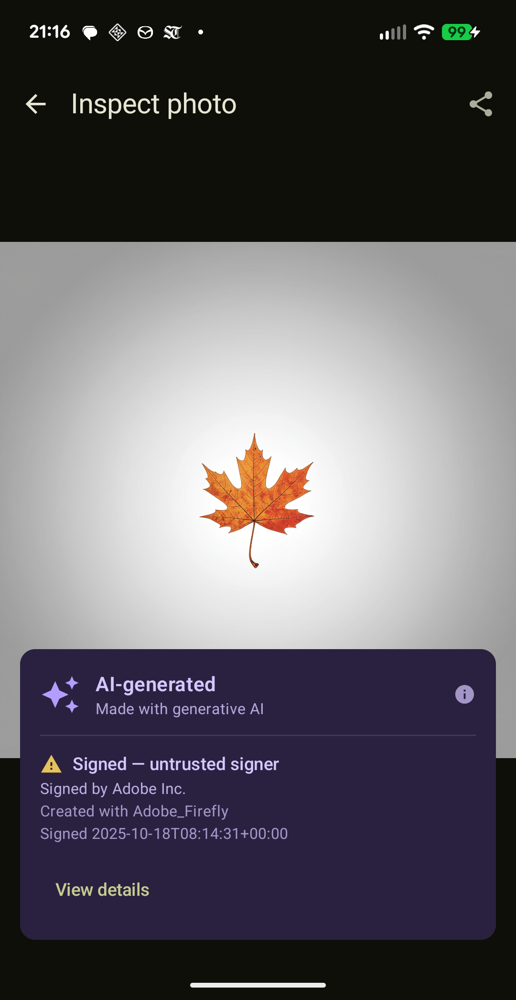

<div align="center">


# C2PA Verify

**See who made a photo, and whether you can trust it.**

[](https://github.com/Wavesonics/C2PAVerify/actions/workflows/ci.yml)
<!--
[](https://play.google.com/store/apps/details?id=com.darkrockstudios.apps.c2paverify)
-->
[](https://github.com/Wavesonics/C2PAVerify/releases/latest)

</div>

C2PA Verify is an Android app that reads the [Content Credentials](https://contentcredentials.org/)
(C2PA) embedded in a photo and tells you, at a glance, where the image came from: who signed it,
the tool that created it, whether it has been edited or generated by AI, and whether the signer is
one you can trust.

<div align="center">



</div>

## Why
C2PA could be an important standard in the fight to know whats real in our increasingly AI slopped world.
Some cameras are coming on the market that supported signing their photos to prove they were taken
with a real camera. Some image editing software already supports C2PA data handling. But there is one
gap, the last mile if you will. What does it matter if a photo has a full C2PA chain, if no one can read
it?

We need to surface this information to users in a useful and easy to access manner. So this app is
a first attempt at that. I imagine in the future tools like this will be build right into web-browsers
and image viewers, but until they are, I hope this tool might be useful to a couple people.

## 🪨 Dark Rock Studios

[**Dark Rock Studios**](https://darkrock.studio/) is all about building **Free and Open Source Software**.

🐛 Found bugs?  
💡 Have suggestions?  
📚 Want to help translate?  
🎮 Interested in our other apps?  
👉 Join our community of Open Source enthusiasts on [**Discord**](https://discord.gg/ju2RQa5x8W)!

## Build

```bash
./gradlew assembleDebug
```

Open the project in Android Studio and run the `app` configuration on a device or emulator.

## License

[MIT](LICENSE) © 2026 Adam Brown
